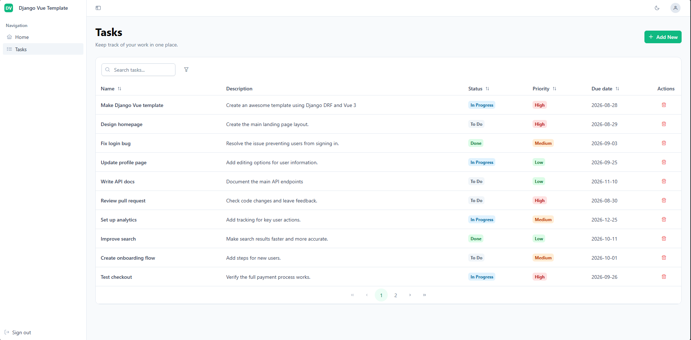

# Django Vue Template

A production-ready starter template built with Django REST Framework and Vue 3 that provides a solid foundation for building modern web applications.



## What's included
- **Authentication** - Cookie-based JWT authentication using HttpOnly cookies 
- **Docker Support** - Full development and production environment setup 
- **Custom User Model** - Email and username authentication with registration 
- **Task Management** - Example CRUD app demonstrating best practices 
- **Standardized Responses** - Consistent API response format across endpoints 
- **API Documentation** - OpenAPI schema with interactive Swagger UI 
- **Theme Support** - Light and dark theme switching 

## Technologies
### Frontend

- [Vue 3](https://vuejs.org/): frontend framework with [Vite](https://vite.dev/)
- [Vue Router](https://router.vuejs.org/): routing
- [Pinia](https://pinia.vuejs.org/): state management
- [PrimeVue](https://primevue.org/): UI component library
- [Tailwind CSS](https://tailwindcss.com/): styling
- [Axios](https://axios-http.com/): API client


### Backend

- [Django](https://www.djangoproject.com/): web framework
- [Django REST Framework](https://www.django-rest-framework.org/): Django toolkit for building Web APIs
- [PostgreSQL](https://www.postgresql.org/): database
- [Simple JWT](https://django-rest-framework-simplejwt.readthedocs.io/): JWT authentication
- [pytest](https://docs.pytest.org/): Python tests with [pytest-django](https://pytest-django.readthedocs.io/en/stable/)
- [drf-spectacular](https://drf-spectacular.readthedocs.io/): interactive OpenAPI documentation
- [uv](https://docs.astral.sh/uv/): fast Python package installer and resolver
  
  
### Developer Experience

- [Docker](https://docs.docker.com/): multi-stage builds for development and production
- [ESLint](https://eslint.org/) & [Prettier](https://prettier.io/): frontend linting and formatting
- [Ruff](https://docs.astral.sh/ruff/): backend linting and formatting
- [pre-commit](https://pre-commit.com/): hooks for frontend and backend checks (optional) 


## Quickstart

### Prerequisites

Before setting up the project, ensure you have the following installed:

- Docker Desktop
- Python 3.12+
- Node.js 22.18+ or 24.12+
- npm
- uv

If on Windows, it is advised to install `make`. Follow the [installation guide](https://gnuwin32.sourceforge.net/packages/make.htm). 

### Initial Setup

Create the environment file:

```bash
cp .env.example .env
```

Then run the setup command:

```powershell
make setup
```

Which will:
- Build the database docker container
- Build backend dependencies using uv
- Build frontend dependencies using npm
- Run Django migrations

Next, start the development environment:

```powershell
make dev
```

This will start PostgreSQL, Django, and Vue servers for local development.

### URLs

- Frontend: http://localhost:5173
- API: http://localhost:8000/api/
- API docs: http://localhost:8000/api/docs/
- OpenAPI schema: http://localhost:8000/api/schema/
- Health check: http://localhost:8000/api/health/
- Django admin: http://localhost:8000/admin/

## Full Docker setup

Runs the entire application in Docker containers. Requires [Docker Desktop](https://docs.docker.com/desktop/).

Using docker compose:
```powershell
docker compose --profile full up --build
docker compose --profile full exec backend python manage.py migrate
```

## Native setup

Runs PostgreSQL, Django, and Vue locally. Requires Python 3.12+, Node.js 22.18+ or 24.12+, npm, and PostgreSQL 17+.

Install and start the backend:
```powershell
cd backend
uv sync
uv run python manage.py migrate
uv run python manage.py runserver
```

In another terminal, install and start the frontend:
```powershell
cd frontend
npm install
npm run dev
```

## Pre-commit Hooks

This project includes pre-commit hooks to ensure code quality and consistency before commits.

### Setup

Install the Git hooks:
```powershell
uv run pre-commit install
```

Run manually to ensure hooks are installed:
```powershell
uv run pre-commit run --all-files
```

Hooks will run automatically on `git commit` and can be bypassed with `--no-verify` if needed.

## Deployment

### Environment Configuration

Create a `.env` file with production values:
```bash
# Database settings
POSTGRES_DB=myprojectdb
POSTGRES_USER=myprojectuser
POSTGRES_PASSWORD=your-secure-password
POSTGRES_HOST=db
POSTGRES_PORT=5432

# Django settings
DJANGO_SECRET_KEY=your-secure-secret-key
DJANGO_DEBUG=False
DJANGO_ALLOWED_HOSTS=yourdomain.com,www.yourdomain.com
CORS_ALLOWED_ORIGINS=https://yourdomain.com,https://www.yourdomain.com
BACKEND_PORT=8000
FRONTEND_PORT=5173
```

### Production Build with Docker

Build and run the production environment:

```powershell
make prod
```

Or manually:
```powershell
docker compose -f docker-compose.prod.yaml up --build
```

### Database Migrations

Run migrations in production:
```powershell
docker compose -f docker-compose.prod.yaml exec backend python manage.py migrate
```

## License

This template is released under the [MIT License](LICENSE), free to use for personal and commercial projects.

